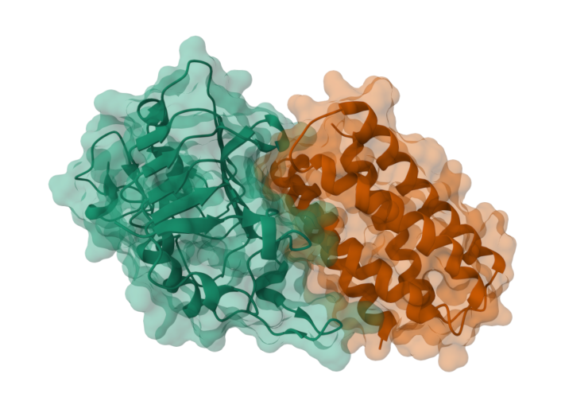

# FastPLMs


FastPLMs provides compact, Hugging Face-compatible implementations of protein
language and structure models. The project keeps the familiar Transformers
interface while making attention, embedding, generation, folding, provenance,
and validation behavior explicit.

The runtime package does not import an official model checkout. Each supported
family instead has a pinned upstream source under `vendor/upstream/`, an
immutable checkpoint identity, and a declared state transformation. Release
workflows compare the resulting FastPLMs artifact against that official source.

## Contents

- [Why FastPLMs](#why-fastplms)
- [Supported models](#supported-models)
- [Installation](#installation)
- [Quick start](#quick-start)
- [Usage examples](#usage-examples)
- [Attention backends](#attention-backends)
- [Design choices](#design-choices)
- [Validation and reproducibility](#validation-and-reproducibility)
- [Files-only Hub publication](#files-only-hub-publication)
- [Documentation](#documentation)
- [Contributing and citation](#contributing-and-citation)

## Why FastPLMs

Protein models are often published with architecture-specific loading code,
tokenization conventions, attention implementations, and output formats.
FastPLMs separates those concerns:

- Transformers auto classes provide a consistent loading interface.
- Model-specific adapters preserve native biological token and structure
  semantics.
- A shared embedding API returns ordered, residue-aware representations.
- Attention backends are explicit capabilities rather than silent fallbacks.
- The model registry records checkpoint, source, conversion, precision,
  license, and test contracts in one typed manifest.
- Official repositories are isolated parity oracles, not production
  dependencies.

The architecture is not the whole claim. A model is release-visible only when
its configuration, tokenizer behavior, state transformation, representative
inference, artifact contents, and legal inventory are defined and tested.

## Supported models

The generated [support matrix](docs/generated/support.md) is the authoritative
checkpoint list. It is rendered from
[`src/fastplms/models.toml`](src/fastplms/models.toml), which also defines valid
AutoClasses, attention backends, precision paths, and release tiers.

| Family | Primary use | Input contract | Important distinction |
| --- | --- | --- | --- |
| ESM2 | Sequence representations and masked language modeling | Tokenizer | Preserves ESM2 encoder, MLM, contact, and classification contracts |
| ESM++ / ESMC | Sequence representations and masked language modeling | Tokenizer | Biohub ESMC implementation and ESMFold2 language-model backbone |
| ESM3 | Multimodal protein modeling and generation | Model sequence helpers | Retains sequence, structure, and function tracks |
| E1 | Retrieval-augmented protein encoding | Raw sequences | No tokenizer; native E1 preparation is preserved |
| DPLM | Discrete diffusion protein generation | Tokenizer | Confidence-based iterative unmasking |
| DPLM2 | Amino-acid and structure co-generation | Multimodal tokenizer | Separate structure and amino-acid boundary tokens |
| ANKH | T5 protein encoding and sequence-to-sequence modeling | Tokenizer | Optimized encoder plus official-compatible seq2seq head |
| ESMFold | Sequence-to-structure inference | Raw sequences | Meta ESMFold contract with FastPLMs ESM2 backbone |
| ESMFold2 | Sequence and complex structure prediction | Structure inputs | Learned ESMC state projection and explicit ESMC precision policy |
| Boltz2 | Structure prediction | Prepared structure inputs | Provisional end-to-end numerical-equivalence status |

The model manifest, not this summary, controls support. A backend or AutoClass
that is valid for one family may be rejected by another.

## Installation

FastPLMs 1.0 requires Python 3.11 through 3.14, PyTorch 2.13, and Transformers
5.13. For a development checkout:

```bash
git clone --recurse-submodules https://github.com/Synthyra/FastPLMs.git
cd FastPLMs
uv sync --extra dev
```

If the repository was cloned without submodules:

```bash
git submodule update --init --recursive
```

Install a pinned Git revision when only the runtime package is needed:

```bash
python -m pip install \
  "fastplms @ git+https://github.com/Synthyra/FastPLMs.git@<revision>"
```

Optional dependency groups are isolated by purpose:

| Extra | Purpose |
| --- | --- |
| `structure` | ESMFold2 and Boltz2 structure dependencies |
| `flash` | Pinned precompiled Hugging Face FlashAttention kernels |
| `fp8` | Experimental ESMFold2 ESMC FP8 inference |
| `train` | Trainer, Accelerate, datasets, and PEFT workflows |
| `dev` | Tests, type checking, linting, and package builds |

Core installation contains Torch, Transformers, Hugging Face Hub, tokenizers,
safetensors, NumPy, einops, and tqdm. Official reference implementations are
not installed into the runtime environment.

## Quick start

Load a model with its standard Transformers auto class:

```python
from transformers import AutoModel

model = AutoModel.from_pretrained(
    "Synthyra/ESM2-150M",
    trust_remote_code=True,
    attn_implementation="flex_attention",
)
model.eval()
```

The Hub identifier assumes that the manifest-built FastPLMs 1.0 artifact has
been published. Before publication, build the local artifact and replace the
identifier with `dist/hub/ESM2-150M`.

Tokenizer-based models use the tokenizer paired with the same artifact:

```python
import torch
from transformers import AutoTokenizer

tokenizer = AutoTokenizer.from_pretrained(
    "Synthyra/ESM2-150M",
    trust_remote_code=True,
)
batch = tokenizer(
    ["MSTNPKPQRKTKRNT", "MKTIIALSYIFCLVFA"],
    padding=True,
    return_tensors="pt",
)

with torch.inference_mode():
    output = model(**batch)

print(output.last_hidden_state.shape)
```

E1 is intentionally different. It has no tokenizer and retains its native
raw-sequence preparation path. Use `model.embed_dataset(...)` for ordinary
sequence representations or the explicit E1 preparation methods for lower
level token tensors.

## Usage examples

### Ordered sequence embeddings

The package function and model method share the same implementation:

```python
from fastplms import EmbeddingInput, embed_dataset

result = embed_dataset(
    model,
    [
        EmbeddingInput("protein-a", "MSTNPKPQRKTKRNT"),
        EmbeddingInput("protein-a", "MKTIIALSYIFCLVFA"),
    ],
    batch_size=2,
    pooling=("mean", "std"),
    output="embeddings",
)
```

`EmbeddingResult` preserves order, duplicate identifiers, and the original
sequence. Each record contains an identifier, sequence, and tensor:

```python
for record in result.records:
    tensor = record.load_tensor()
    print(record.id, record.sequence, tensor.shape)
```

Calling `result.as_dict(key="id")` raises when identifiers repeat unless an
explicit duplicate policy is provided. This avoids silently overwriting FASTA
records.

### FASTA input and in-memory output

Pass a FASTA path directly. Multi-line sequences and record identifiers are
preserved:

```python
result = model.embed_dataset(
    "proteins.fasta",
    batch_size=32,
    pooling=("mean", "max"),
)

for record in result:
    print(record.id, record.tensor.shape)
```

When `output` is omitted, tensors remain in memory. Multiple poolers are
concatenated in request order, and `result.metadata["pool_slices"]` records the
slice belonging to each transformation.

### Full residue and hidden-state embeddings

Use full embeddings when a downstream task needs one vector per biological
residue:

```python
residue_result = model.embed_dataset(
    ["MSTNPKPQRKTKRNT", "MKTIIALSYIFCLVFA"],
    batch_size=2,
    full_embeddings=True,
)

for record in residue_result:
    print(record.sequence, record.tensor.shape)
```

Each tensor has shape `(l, d)` after BOS, EOS, padding, chain delimiters, and
other non-biological positions are removed. To retain every returned model
state:

```python
state_result = model.embed_dataset(
    ["MSTNPKPQRKTKRNT"],
    full_embeddings=True,
    store_all_hidden_states=True,
)
print(state_result[0].tensor.shape)
```

The hidden-state tensor has shape `(n, l, d)`, where `n` follows the model's
native hidden-state output order.

### Safetensors output and exact resume

Directory output uses sharded safetensors by default:

```python
result = model.embed_dataset(
    "proteins.fasta",
    batch_size=64,
    pooling=("mean",),
    output="artifacts/protein-embeddings",
    format="safetensors",
    resume=True,
)
```

The directory contains tensor shards, `index.json`, and `run.json`. The index
records sequence order, identifiers, shapes, dtypes, hashes, and shard keys.
The run manifest binds the input, model state, tokenizer policy, backend, and
pooling configuration. Resume is accepted only when existing records are the
exact ordered prefix of the same run.

### SQLite streaming

SQLite commits each completed batch and is useful for long jobs:

```python
result = model.embed_dataset(
    "proteins.fasta",
    batch_size=64,
    pooling=("mean", "std"),
    output="artifacts/protein-embeddings.sqlite",
    format="sqlite",
    resume=True,
)
```

BF16 tensors are stored as raw bytes with an explicit dtype. Resume rejects a
changed model state, input order, sequence, tokenizer, pooling configuration,
or attention backend.

### DPLM sequence generation

DPLM starts from a tokenized sequence whose biological positions define the
requested length. Iterative unmasking fills those positions:

```python
import torch
from transformers import AutoModelForMaskedLM, AutoTokenizer

checkpoint = "Synthyra/DPLM-150M"
tokenizer = AutoTokenizer.from_pretrained(checkpoint)
generator = AutoModelForMaskedLM.from_pretrained(
    checkpoint,
    trust_remote_code=True,
).cuda().eval()

input_ids = tokenizer("A" * 64, return_tensors="pt")["input_ids"].cuda()
with torch.inference_mode():
    generated_ids = generator.generate(input_ids, max_iter=100)

sequence = tokenizer.decode(
    generated_ids[0],
    skip_special_tokens=True,
).replace(" ", "")
print(sequence)
```

The official schedule uses 500 steps when `max_iter` is omitted. Reducing the
step count changes the sampling process. DPLM2 uses separate structure and
amino-acid tracks; see the [model guide](docs/models.md) for its explicit
boundary-token example.

### ESM3 sequence generation

ESM3 keeps multimodal helpers on the loaded model:

```python
from fastplms.models.esm3.modeling_esm3 import FastESM3GenerationConfig
from transformers import AutoModel

esm3 = AutoModel.from_pretrained(
    "Synthyra/ESM3_small",
    trust_remote_code=True,
).eval()
config = FastESM3GenerationConfig(num_steps=8, temperature=1.0, seed=7)
generated = esm3.generate("MK____A", config)
print(generated)
```

Underscores mark sequence positions to generate. Sequence-only forward passes
use `esm3.tokenize_sequences(...)`; structure and function tracks remain
available through the model's multimodal interface.

### Boltz2 protein structure prediction

Boltz2 exposes a protein-only convenience path in addition to its prepared
feature interface:

```python
import torch
from transformers import AutoModel

boltz = AutoModel.from_pretrained(
    "Synthyra/Boltz2",
    trust_remote_code=True,
    dtype=torch.float32,
).cuda().eval()
prediction = boltz.predict_structure(
    amino_acid_sequence="MSTNPKPQRKTKRNTNRRPQDVKFPGG",
    recycling_steps=3,
    num_sampling_steps=50,
    diffusion_samples=1,
)
boltz.save_as_cif(prediction, "prediction.cif")
print(prediction.plddt, prediction.ptm, prediction.iptm)
```

Boltz2 remains provisional in FastPLMs 1.0. This interface is covered for
configuration, declared inference-core state, feature preparation, and seeded
execution, but it is not yet an official end-to-end numerical-equivalence
claim.

### ESMFold structure prediction

ESMFold accepts raw sequences:

```python
import torch
from transformers import AutoModel

folder = AutoModel.from_pretrained(
    "Synthyra/FastESMFold",
    trust_remote_code=True,
    dtype=torch.float32,
).cuda().eval()

with torch.inference_mode():
    structure = folder.infer("MKTLLILAVVAAALA")

print(structure["mean_plddt"])
```

FastPLMs does not expose ProteinTTT for ESMFold. The pinned folding checkpoint
does not contain a trained masked-language-model head for that objective.

### ESMFold2 folding and learned representations

ESMFold2 exposes a simple single-protein helper and lower-level complex input
types:

```python
from transformers import AutoModel

folder = AutoModel.from_pretrained(
    "Synthyra/ESMFold2-Fast",
    trust_remote_code=True,
    device_map={"": "cuda:0"},
    esmc_precision="auto",
).eval()

result = folder.fold_protein(
    "MSTNPKPQRKTKRNT",
    num_loops=1,
    num_sampling_steps=200,
    num_diffusion_samples=1,
    seed=7,
)
pdb_text = folder.result_to_pdb(result)
print(result.ptm, result.plddt.mean().item())
```

Its learned sequence representation combines 81 ordered ESMC hidden states
with the folding checkpoint's projection:

```python
# H: (b, l, 81, 2560)
Z = folder.project_esmc_hidden_states(H)  # Z: (b, l, 256)
```

`folder.embed_dataset(..., full_embeddings=True)` returns one `(l, 256)` tensor
per single-chain sequence. The embedding path rejects complexes, ligands, MSAs,
chain-separated inputs, `cls`, and `parti`.

`esmc_precision="auto"` always resolves to BF16. Explicit FP8 is experimental,
inference-only, and strict:

```python
folder.reload_esmc(precision="fp8", device="cuda:0")
print(folder.esmc_precision_status)
```

FP8 raises when the validated CUDA and Transformer Engine path is unavailable.
Gradient-enabled paths reload canonical BF16 ESMC weights.

### Test-time training

Supported masked-language models expose opt-in, low-rank test-time adaptation:

```python
metrics = generator.ttt(
    seq="MSTNPKPQRKTKRNT",
    ttt_config={
        "steps": 3,
        "ags": 1,
        "batch_size": 1,
        "seed": 7,
    },
)
generator.ttt_reset()
```

TTT updates injected adapter parameters, not base checkpoint weights. It adds
latency and memory, can worsen a prediction, and does not establish biological
function. See the [TTT guide](docs/ttt.md) for supported families and folding
behavior.

### Binder design research example

The FastPLMs binder-design example optimizes a soft binder sequence against
ESMFold2 structural objectives and an ESM++ sequence prior:



```bash
python examples/binder_design_fastplms.py \
  --target-name pd-l1 \
  --binder-name minibinder \
  --batch-size 4 \
  --steps 150 \
  --output-dir artifacts/binder-design
```

The workflow writes optimization trajectories, ranked sequences, structures,
confidence outputs, and selection tables. These are model outputs for
prioritization, not experimental evidence of binding, specificity, expression,
or therapeutic activity. See the [binder-design guide](docs/binder_design.md).

### Fine-tuning

FastPLMs follows `PreTrainedModel` conventions for Trainer, Accelerate, and
PEFT workflows. Run the example with the training, plotting, and evaluation
dependencies:

```bash
uv run \
  --extra train \
  --with matplotlib \
  --with scikit-learn \
  --with scipy \
  --with seaborn \
  python examples/fine_tuning.py \
  --task classification \
  --model_path Synthyra/ESM2-8M
```

For residue-level tasks, align labels to biological residues rather than
assuming tokenizer position equals residue position. Record the base revision,
tokenizer identity, split strategy, target modules, precision, backend, and
seed. See the [fine-tuning guide](docs/finetuning.md).

## Attention backends

Select a backend at load time or change it explicitly after loading:

```python
model.set_attn_implementation("sdpa")
```

| Backend | Use when | Main constraint |
| --- | --- | --- |
| `eager` | Attention matrices or the `parti` pooler are required | Materializes attention scores |
| `sdpa` | A stable default or official-parity path is required | Torch selects the underlying kernel |
| `flex_attention` | Padding-aware compiled attention is useful | First use compiles for the requested shape and semantics |
| `flash_attention_2` | A supported ESM2 or ESM++ BF16 CUDA path needs a precompiled kernel | BF16-only and family-limited |
| `flash_attention_3` | A supported ESM2, ESM++, or DPLM BF16 CUDA path needs a precompiled kernel | BF16-only and family-limited |

FastPLMs does not implement an `auto` backend and does not silently replace an
unavailable request. Leaving `attn_implementation` unspecified lets
Transformers choose its standard default. Explicit requests either run the
declared implementation or raise.

The `flash` extra installs Hugging Face `kernels`, not the `flash-attn` source
package. FastPLMs resolves immutable FlashAttention 2 and 3 snapshots recorded
in `kernels.lock`, validates the compatible binary, and never compiles a source
fallback. See the [attention guide](docs/attention_backends.md) for exact
family, dtype, padding, and numerical contracts.

## Design choices

### Manifest-driven model support

[`src/fastplms/models.toml`](src/fastplms/models.toml) is the source of truth
for model IDs, files, revisions, AutoClasses, tokenizer modes, transformations,
attention and precision capabilities, upstreams, licenses, and release tiers.
Support tables and model cards are generated from it.

This avoids three common failure modes: a model appearing in documentation but
not release tooling, a checkpoint conversion with no immutable identity, and a
backend being advertised because it imports rather than because it was tested.

### Native biological preparation

The shared interface does not force every family through one tokenizer. E1
keeps raw-sequence preparation. DPLM2 keeps modality-specific boundaries.
Structure models retain their native protein, nucleic-acid, ligand, MSA, and
chain representations. Shared pooling begins only after each model identifies
its biological residue positions.

### Ordered embedding results

Protein datasets routinely contain duplicate sequences and duplicate FASTA
identifiers. FastPLMs returns ordered records instead of a sequence-keyed
dictionary so those inputs are not silently lost. Persistent formats record
per-tensor hashes and complete run fingerprints for auditing and exact resume.

### Explicit precision and backend policy

Parameter storage, compute dtype, and attention implementation are separate
choices. DPLM and several structure paths retain FP32 parameters while using
CUDA BF16 autocast. ESMFold2 controls the ESMC backbone independently from its
folding trunk. Unsupported combinations fail before inference.

### Official code is a parity oracle

Pinned official repositories live under `vendor/upstream/` and are used only
in isolated reference stages. Production modules cannot import them, modify
`sys.path` to reach them, or download source code at import time. Artifacts are
self-contained and load through Transformers with `trust_remote_code=True`.

### Fail-closed artifacts and licenses

Artifact construction verifies required file identities, canonical legal
texts, conversion provenance, generated model-card metadata, and offline
loading. A missing or changed required file is a release error. Source licenses
and notices are centralized under [`LICENSES/`](LICENSES/); checkpoint-specific
terms remain distinct from the FastPLMs Apache-2.0 code license.

## Validation and reproducibility

All release validation is containerized. The portable runner accepts the host
and identity at invocation time:

```bash
python -m tools.remote \
  --host user@gpu-host \
  --identity /path/to/key \
  --suite check
```

Release tiers cover checks, compliance, structure, features, artifacts, and
benchmarks. Missing required dependencies or declared backends fail rather than
skip. Expensive suites retain explicit `gpu`, `slow`, `large`, and `structure`
markers.

The canonical Docker workflow uses one candidate image and isolated official
reference images:

```bash
git submodule update --init --recursive
sudo docker buildx bake -f docker/docker-bake.hcl candidate reference-esm2 --load
sudo docker compose -f docker/compose.yaml run --rm candidate \
  python -m pytest tests/parity -k esm2 -v
```

Always pass `--ipc=host` to Dockerized PyTorch runs. Benchmarks are separate
from correctness checks and retain raw samples, environment metadata, warm-up,
compile-time, steady-state, padding, and memory measurements.

Boltz2 remains provisional in FastPLMs 1.0. Configuration, declared
inference-core state, feature preparation, and seeded execution are tested, but
native-environment BF16 end-to-end inference does not yet meet the fixed
numerical-equivalence limits. FastPLMs therefore makes no official inference
equivalence claim for Boltz2.

## Files-only Hub publication

After building and validating local artifacts, update Hub runtime files and
model cards without uploading or deleting checkpoint weights:

```bash
PYTHONPATH=src python -m tools.artifacts.publish \
  --files-only esmfold2 esmfold2_fast \
  --artifact-root dist/hub \
  --dry-run
```

Remove `--dry-run` after reviewing the exact add-only file plan. Repository
targets come exclusively from `models.toml`; authentication uses `HF_TOKEN` or
the cached Hugging Face login. See [Local Hub artifacts](docs/artifacts.md) for
the full safety contract and the four-model ESMFold2 command.

## Documentation

- [Documentation index](docs/README.md)
- [Architecture](docs/architecture.md)
- [Models and generated support](docs/models.md)
- [Embedding API](docs/embedding_api.md)
- [Attention backends](docs/attention_backends.md)
- [ESMFold2](docs/esmfold2.md)
- [Test-time training](docs/ttt.md)
- [Binder design](docs/binder_design.md)
- [Fine-tuning](docs/finetuning.md)
- [Testing and compliance](docs/testing.md)
- [Benchmarking](docs/benchmarking.md)
- [Local Hub artifacts](docs/artifacts.md)
- [Migration to 1.0](docs/migration.md)
- [Licensing](docs/licensing.md)
- [Contributing](docs/contributing.md)

FastPLMs 1.0 is an intentional API break. There are no legacy import, backend,
embedding-storage, or command shims. Use the migration guide when moving from
the pre-1.0 repository layout.

## Contributing and citation

Start with [AGENTS.md](AGENTS.md) for repository invariants and
[the contributing guide](docs/contributing.md) for the model-addition and
validation workflow. Generated support tables and model cards must be changed
through the manifest or renderer rather than edited directly.

If FastPLMs supports your work, cite FastPLMs and the paper or model card for
the specific checkpoint family:

```bibtex
@misc{FastPLMs,
  author = {Hallee, Logan and Bichara, David and Gleghorn, Jason P.},
  title = {FastPLMs: Fast, efficient protein language model inference from Hugging Face AutoModel},
  year = {2024},
  url = {https://github.com/Synthyra/FastPLMs},
  doi = {10.57967/hf/3726},
  publisher = {Hugging Face}
}
```
