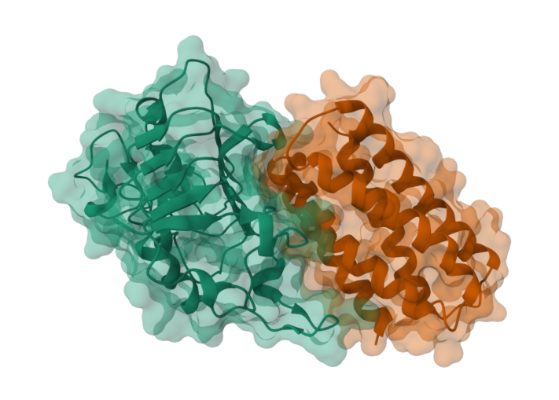

# FastPLMs Binder Design Example

This guide documents the FastPLMs-only binder design workflow in
[`cookbook/tutorials/binder_design_fastplms.py`](../cookbook/tutorials/binder_design_fastplms.py)
and [`cookbook/tutorials/binder_design_fastplms.ipynb`](../cookbook/tutorials/binder_design_fastplms.ipynb).
It mirrors the Biohub ESM binder design tutorial while using only FastPLMs model
repos and FastPLMs loading paths.



The rendered example above is the verified EGFR domain III target, shown in teal,
with a 128 amino acid de novo minibinder, shown in orange.

## Model Roles

The optimizer uses three model roles:

| Role | FastPLMs checkpoints | Used for |
| :--- | :--- | :--- |
| Inversion models | `Synthyra/ESMFold2-Experimental-Fast`, `Synthyra/ESMFold2-Experimental-Fast-Cutoff2025` | Differentiable folding losses during sequence optimization |
| LM regularizer | `Synthyra/ESMplusplus_6B` | ESMC-style pseudoperplexity loss on mutable binder residues |
| Hero critics | `Synthyra/ESMFold2-Experimental-Fast`, `Synthyra/ESMFold2-Experimental-Fast-Cutoff2025`, `Synthyra/ESMFold2-Experimental`, `Synthyra/ESMFold2-Experimental-Cutoff2025` | Final confidence-head pTM, iPTM, pLDDT, structures, and consensus gate |

Optional scaling critics can be enabled with `--use-scaling-critics`. They follow
the official ranking strategy and contribute `distogram_iptm_proxy` scores, but
they are not part of the confidence-head all-hero-iPTM gate because those
checkpoints are used as distogram proxy critics.

## Strategy

The FastPLMs script follows the official binder design workflow:

1. Build a target plus binder prompt. Fixed residues are held fixed and `#`
   residues are optimized.
2. Initialize a differentiable amino acid distribution for each mutable binder
   residue. Cysteine logits are set very low and cysteine gradients are masked.
3. Anneal soft amino acid logits toward a discrete sequence over the optimization
   trajectory.
4. Fold the target and current binder with the inversion ESMFold2 models and
   backpropagate through `res_type_soft`.
5. Optimize three structure losses from the ESMFold2 distogram: binder
   intra-contact confidence, target-binder inter-contact confidence, and binder
   globularity.
6. Add an ESM++ masked-LM pseudoperplexity loss on mutable binder positions.
7. During the final low-temperature steps, run confidence scoring and keep the
   argmax sequence state with the best iPTM.
8. Fold the selected sequence with all hero critics and write structures,
   confidence metrics, logits, trajectory, and selection tables.
9. Rank with the official selection rule: minibinders with pI >= 6 are filtered,
   hero critics contribute mean iPTM, optional scaling critics contribute mean
   distogram iPTM proxy, and the selection score is `0.5 * mean_iPTM + 0.5 *
   mean_proxy`.

The script also reports an extra `all_hero_critics_pass` field for stricter
internal screening. It is true only when the minimum hero-critic iPTM is greater
than the configured consensus threshold, currently `0.9`.

## Local Docker Run

Run on a Linux CUDA workstation with the ESMFold2 Docker image:

```bash
cd /home/ubuntu/FastPLMs

sudo -n docker run --gpus all --rm \
  -v /home/ubuntu/FastPLMs:/app \
  -v /home/ubuntu/FastPLMs:/workspace \
  -v /home/ubuntu/.cache/huggingface:/workspace/.cache/huggingface \
  -w /workspace fastplms-esmfold2 \
  python /app/cookbook/tutorials/binder_design_fastplms.py \
    --backend local \
    --target-name egfr \
    --binder-sequence '################################################################################################################################' \
    --not-antibody \
    --steps 150 \
    --batch-size 1 \
    --seed 103 \
    --output-dir /workspace/campaign_egfr_len128_b1_s150_seed103_consensus_cli
```

`--binder-sequence` is 128 `#` characters, so the binder is generated from
scratch. Use `--binder-name minibinder` to sample a minibinder length from the
official 60 to 200 amino acid range, or provide a scaffolded prompt with fixed
residues and mutable `#` positions.

## Modal Run

The same script can be deployed to Modal:

```bash
modal deploy cookbook/tutorials/binder_design_fastplms.py
```

Then run the CLI against the deployed app:

```bash
python cookbook/tutorials/binder_design_fastplms.py \
  --backend modal \
  --target-name egfr \
  --binder-sequence '################################################################################################################################' \
  --not-antibody \
  --steps 150 \
  --batch-size 1 \
  --seed 103 \
  --output-dir binder_design_egfr_len128_seed103
```

Modal jobs return the same result rows and write the same local
`results.parquet` and `selection.parquet` tables after the remote call returns.

## Output Files

Each run writes:

| File | Contents |
| :--- | :--- |
| `best_sequences.fasta` | Target and selected binder sequence for each batch item |
| `trajectory.jsonl` | Per-step structure, LM, and total losses |
| `results.parquet` | One row per final critic with iPTM, pTM, pLDDT, distogram proxy, PDB text, CIF text, and logits path |
| `selection.parquet` | Official-style post-filtered ranking with `selection_score`, `iptm_score`, `iptm_proxy_score`, pI, and `all_hero_critics_pass` |
| `batch*_*.pdb` and `batch*_*.cif` | Final structures from each critic |
| `batch*_*_logits.pt` | Final binder logits saved for reproducibility and inspection |

## Verified EGFR Result

The following result was generated on the workstation with the local Docker
command above.

| Field | Value |
| :--- | :--- |
| Target | EGFR domain III crop from `TARGET_SEQUENCES["egfr"]` |
| Binder type | 128 amino acid de novo minibinder |
| Seed | `103` |
| Steps | `150` |
| Batch size | `1` |
| Output directory | `/home/ubuntu/FastPLMs/campaign_egfr_len128_b1_s150_seed103_consensus_cli` |
| Official selection score | `0.456935` |
| Hero mean iPTM | `0.913870` |
| Hero min iPTM | `0.904600` |
| All hero critics above 0.9 | `True` |

Binder sequence:

```text
SAVKHLLEIVKYLEEAIEKALEVDPVFLVPPAAEELLIAAKVIKELAKENPELIEVYELLMKAVKGLKKLVRSNDKEILREVIRLLRKAAKVIREILKNNPDLDPELRKALEELAKVLEEIAEVLEQQ
```

Per-critic metrics:

| Critic | iPTM | pTM | Mean pLDDT | Distogram iPTM proxy |
| :--- | ---: | ---: | ---: | ---: |
| `ESMFold2-Experimental-Fast` | `0.910996` | `0.940850` | `0.919280` | `0.869852` |
| `ESMFold2-Experimental-Fast-Cutoff2025` | `0.906549` | `0.933330` | `0.903867` | `0.851969` |
| `ESMFold2-Experimental` | `0.904600` | `0.935770` | `0.910045` | `0.827132` |
| `ESMFold2-Experimental-Cutoff2025` | `0.933336` | `0.953066` | `0.933806` | `0.888729` |

Nearby cheaper step counts were tested with the same seed and 128-residue prompt:

| Steps | Hero min iPTM | Hero mean iPTM | All hero critics above 0.9 | Notes |
| ---: | ---: | ---: | :---: | :--- |
| `140` | `0.876993` | `0.897606` | `False` | Passed pI filter, failed consensus |
| `145` | `0.863137` | `0.895119` | `False` | Filtered by pI |
| `148` | `0.882141` | `0.908492` | `False` | Passed pI filter, failed consensus |
| `149` | `0.894900` | `0.903115` | `False` | Filtered by pI |
| `150` | `0.904600` | `0.913870` | `True` | Cheapest verified passing run in this bracket |

This is an ESMFold2-critic result, not experimental validation. Other structure
predictors or docking pipelines can disagree, so high FastPLMs ESMFold2 iPTM
should be treated as a screening signal that still needs orthogonal validation.

## Test Commands

The focused binder tests run in the ESMFold2 Docker image:

```bash
docker run --rm -v /home/ubuntu/FastPLMs:/app -w /app fastplms-esmfold2 \
  python -m pytest /app/testing/test_binder_design_fastplms.py -m "not gpu" -v

docker run --gpus all --rm -v /home/ubuntu/FastPLMs:/app -w /app fastplms-esmfold2 \
  python -m pytest /app/testing/test_binder_design_fastplms.py \
    -k tiny_design_dry_run_writes_outputs -v
```

The verified run used the current focused test set:

- `11 passed, 2 deselected` for non-GPU binder tests.
- `1 passed, 12 deselected` for the CUDA tiny design dry run.
