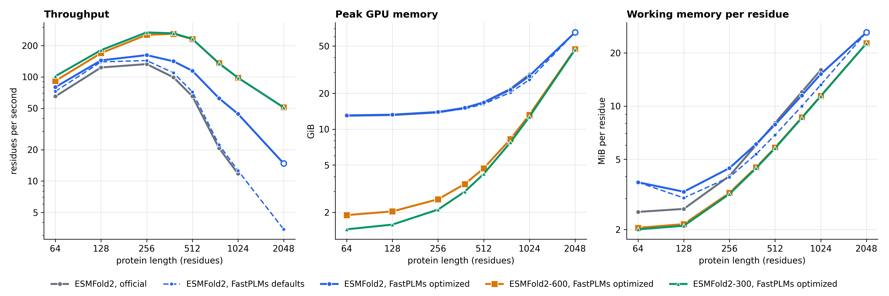

# ESMFold2

FastPLMs supports six Biohub ESMFold2 variants:

| Official checkpoint | FastPLMs mirror | Folding blocks | MSA conditioning | Confidence head | Inference evidence |
| --- | --- | ---: | --- | --- | --- |
| `biohub/ESMFold2` | `Synthyra/ESMFold2` | 48 | Optional; single-sequence and MSA-conditioned inference are supported | Enabled | Established family contract |
| `biohub/ESMFold2-Fast` | `Synthyra/ESMFold2-Fast` | 24 | None; inference-optimized single-sequence conditioning | Enabled | Established family contract |
| `biohub/ESMFold2-Experimental-Cutoff2025` | `Synthyra/ESMFold2-Experimental-Cutoff2025` | 48 | Optional; experimental full-checkpoint contract | Enabled | Experimental family contract |
| `biohub/ESMFold2-Experimental-Fast-Cutoff2025` | `Synthyra/ESMFold2-Experimental-Fast-Cutoff2025` | 24 | None; experimental Fast single-sequence-conditioning contract | Enabled | Experimental family contract |
| `biohub/ESMFold2-Experimental-Fast-base300M-step1500k` | `Synthyra/ESMFold2-300` | 24 | None; single-sequence conditioning | Disabled; backbone `960 x 30` | Published; single-protein comparison passed; full benchmark pending |
| `biohub/ESMFold2-Experimental-Fast-base600M-step1500k` | `Synthyra/ESMFold2-600` | 24 | None; single-sequence conditioning | Disabled; backbone `1152 x 36` | Published; not inference validated |

The Fast variants are optimized for single-sequence conditioning and are not
MSA-conditioned. They accept the checkpoint typed multichain and multimolecule
inputs, but each protein chain must use single-sequence mode with `msa=None`.
Use the corresponding full ESMFold2 variant when a protein input has an MSA.
This distinction follows the
official Biohub architecture description: Appendix A.2.1 reports 24 folding
blocks for Fast versus 48 for full ESMFold2 and describes Fast as operating
without MSA conditioning for single-sequence inference
([Biohub preprint](https://biohub.ai/papers/esm_protein.pdf)).

The base300M and base600M checkpoints are experimental architecture variants.
Their pinned configs declare 24 folding blocks, no MSA conditioning, and
`confidence_head.enabled=false`. They therefore do not produce pLDDT, pTM,
iPTM, or PAE outputs. The 300M single-protein comparison passed, as reported
in [ESMFold2-300 validation](validation/esmfold2_small.md). This is not the
full structure benchmark, which remains pending. The mirrors are published at
revisions `a38a62ae930d157484b331c2bf4241684573adba` (300M) and
`71c67d0b2b73dc245ea7c3cc0d0476439a882d08` (600M). The 600M variant has no
inference validation result. Local artifact building does not modify the
Hub. Files-only publication is a separate, add-only workflow described in
[Hub artifacts](artifacts.md).

## Progress display and confidence-free export

`fold`, `fold_protein`, `infer_protein`, and direct `forward` calls accept
`verbose=False` by default. Set `verbose=True` to show progress for input
preparation, backbone features, recycling, diffusion steps, confidence
calculation when enabled, and decoding. Progress display does not change the
sampling settings or random-number sequence.

For a two-protein example that saves `complex.cif`, start with a model card's
Quick start. The 300M and 600M results keep confidence values unavailable;
their CIF files use `?` for unknown confidence-derived B factors.

## Dependencies and platform requirements

ESMFold2 requires the structure dependencies, Python 3.11-3.14, PyTorch
2.13, Transformers 5.13, and a CUDA device for its published execution
contract. Docker execution with the required capabilities and numerical tests
is valid on any compatible host. Record the actual accelerator, architecture,
driver, and software versions in each validation report. The historical release
measurements were collected in a containerized Linux aarch64 environment on an
NVIDIA GH200 workstation; those measurements remain tied to that environment.

```bash
uv pip install \
  -r requirements/core.in \
  -r requirements/features/structure.in \
  -c requirements/constraints/validation.txt
```

These files declare dependencies. They do not install FastPLMs. The loading
example below obtains runtime source from the pinned Hugging Face model with
`trust_remote_code=True`.

The structure dependency file retains Accelerate specifically for the documented
`device_map`-based, memory-safe loading of the 6B ESMC backbone. It retains
OmegaConf for the explicit trusted-deserialization boundary in
`Boltz2Model.from_boltz_checkpoint`, where official Lightning checkpoints may
contain OmegaConf objects. Plotting, reporting, table, and antibody-numbering
packages are not structure runtime dependencies and remain in the reporting or
binder dependency files.

The reference folding path is included in the structure dependencies. The named
`cuequivariance` kernel backend is a separate opt-in because it adds NVIDIA's
CUDA-specific binary runtime:

```bash
uv pip install \
  -r requirements/core.in \
  -r requirements/features/structure.in \
  -r requirements/features/cueq.in \
  -c requirements/constraints/validation.txt
```

The cuEquivariance dependency file pins the version-aligned frontend and CUDA
kernels used by the release contract: `cuequivariance==0.10.0`,
`cuequivariance-torch==0.10.0`, and
`cuequivariance-ops-torch-cu13==0.10.0`. It selects NVIDIA's
CUDA 13 build because FastPLMs validates PyTorch 2.13 on CUDA 13.0. Do not
install the CUDA 12 and CUDA 13 kernel packages into the same environment.
FastPLMs requires both the frontend and the CUDA ops package before accepting
`model.set_kernel_backend("cuequivariance")`; a frontend-only installation is
not treated as backend availability.

This backend is available only on Linux with an NVIDIA GPU, a compatible
CUDA 13 driver, and CPython 3.11-3.14. NVIDIA publishes both x86-64 and ARM64
manylinux wheels for those interpreters. Results must identify the exact device
and architecture, and performance baselines from different accelerator models
are not interchangeable. Windows, macOS, CPU-only hosts, and the FastPLMs
CUDA 12 legacy reference images are not supported execution paths.
The cuEquivariance Python frontend is Apache-2.0, while the CUDA ops wheels are
distributed under the NVIDIA Software License Agreement and are described by
NVIDIA as beta software. Installing the cuEquivariance dependencies means
accepting those separate NVIDIA terms; FastPLMs does not redistribute the
wheels.

## Loading

```python
from transformers import AutoModel

model = AutoModel.from_pretrained(
    "Synthyra/ESMFold2-Fast",
    trust_remote_code=True,
    attn_implementation="flex_attention",
    device_map={"": "cuda:0"},
    esmc_precision="auto",
).eval()
```

This Fast quick start shows the no-MSA path. It does not enable MSA conditioning
implicitly. For MSA-conditioned inference, load `Synthyra/ESMFold2` or the
experimental full Cutoff2025 checkpoint.

The folding model and its ESMC backbone use the same explicitly resolved
attention implementation. Unsupported names raise. The ESMC checkpoint is
loaded directly on the requested CUDA device when a CUDA device is used. For a
declared ESMC-6B Hub identifier, FastPLMs forwards the immutable revision from
`models.toml` to both configuration and weight loading. Remote ESMC checkpoints
are accepted only when they satisfy the declared backbone projection contract:
ESMC-6B uses 81 states at width 2560, while base300M and base600M use the
declared standard ESM++ small and large layouts. A local checkpoint directory
remains a supported explicit source and has no Hub revision.

The folding checkpoint itself loads with FP32 parameters. Learned projection,
folding trunk, and diffusion computation run under CUDA BF16 autocast. ESMC has
an independent precision policy: its canonical BF16 weights may remain BF16 or
be used to reconstruct the transient FP8 inference path without changing the
folding checkpoint's FP32 storage. Only the ESMC-6B variants can reconstruct
the transient FP8 path; base300M and base600M remain BF16-only for ESMC.

## Atom attention and sampling caches

The atom encoders and the atom decoder attend over atoms in one of two modes:

| Mode | Behavior | Requirements |
| --- | --- | --- |
| `"dense"` (default) | Every atom attends to every atom slot. The official implementation executes this when `flash-attn` is not installed, and every parity and compliance result in this document was measured in it. | None |
| `"windowed"` | Each atom attends to at most 64 real atoms on each side. Padded atom slots are never keys, and their output is zero. The official implementation executes this, with `window_size=(64, 64)`, when `flash-attn` is installed. | CUDA and `torch.nn.attention.varlen` |

```python
model.set_atom_attention("windowed")
```

The windowed mode calls PyTorch's built-in variable-length FlashAttention, so it
needs no extra package and no compilation. It raises for CPU tensors and for a
PyTorch build without that entry point, and it never falls back to dense
attention. Atom attention time and memory then grow linearly with the atom count
instead of quadratically. The two modes differ numerically, so do not mix them
within one comparison. The mode is a runtime setting: it is not stored in the
configuration, and `save_pretrained` does not record it.

Every denoising step conditions on the same pair representation. With the
sampler's `use_inference_cache=True` default, each token-transformer block
projects its pair bias on the first step and reuses that tensor afterwards. The
result is bitwise identical to projecting at every step. The cache holds one
`(batch * samples, tokens, tokens, heads)` tensor per block for one `sample` call.

### Measured folding cost



**ESMFold2 single-chain folding cost by protein length on one NVIDIA H100 80GB HBM3.** Left: throughput in residues per second. Middle: peak allocated GPU memory. Right: working memory per residue, which is peak allocated memory above the loaded weights divided by the protein length. Every fold uses 3 trunk loops, 50 requested sampling steps under the official noise cap of 256 (which runs 35 of them), and 1 diffusion sample, on one fixed pseudo-random protein per length, with PyTorch 2.13.0+cu130, BF16 autocast over FP32 folding parameters, and a BF16 ESMC backbone. Times are medians of two or more end-to-end `infer_protein` calls after a shortened warm-up fold at the same length; at 2,048 residues each series timed one fold without a warm-up. Official is the pinned Biohub implementation on its PyTorch path, which is what it executes without flash-attn or its source-built Triton kernels. FastPLMs defaults changes no setting, and its output is bitwise identical to the previous FastPLMs revision; it adds the sampling pair-bias cache, a single layout of the right stream per chunked triangle update, and the early release of dead pair-sized tensors. FastPLMs optimized adds `set_atom_attention("windowed")` and `set_chunk_size(None)`. Optimized ESMFold2 reaches 1.23x the official throughput at 64 residues and 3.76x at 1,024, for 0.97x the official peak memory there; the bitwise-exact defaults reach 1.07x to 1.13x. ESMFold2-600 and ESMFold2-300 share one 24-block trunk, so their curves nearly coincide. At 2,048 residues unchunked pair updates exhaust this GPU, so the optimized ESMFold2 point there uses 512-row chunks and is drawn hollow: 139 s at a 65 GiB peak, against 596 s for the bitwise-exact defaults, while the official implementation runs out of memory. These folds exhausted GPU memory, so their curves end earlier: ESMFold2, FastPLMs optimized at 2,048 residues; ESMFold2, official at 2,048 residues. All series of a run ran in separate processes on one worker. The longest length comes from a second run, whose repeated measurements of shorter folds agree with the first run within 0.7%.

| Residues | Official (s) | FastPLMs defaults (s) | FastPLMs optimized (s) | Official peak (GiB) | Defaults peak (GiB) | Optimized peak (GiB) | ESMFold2-300 optimized (s) | ESMFold2-300 peak (GiB) |
| ---: | ---: | ---: | ---: | ---: | ---: | ---: | ---: | ---: |
| 64 | 0.98 | 0.88 | 0.80 | 13.0 | 13.1 | 13.1 | 0.63 | 1.4 |
| 256 | 1.93 | 1.78 | 1.58 | 13.8 | 13.8 | 14.0 | 0.96 | 2.1 |
| 512 | 7.84 | 7.13 | 4.47 | 16.8 | 16.3 | 16.8 | 2.21 | 4.2 |
| 768 | 37.10 | 34.49 | 12.32 | 21.9 | 20.4 | 21.5 | 5.71 | 7.8 |
| 1,024 | 87.16 | 81.34 | 23.21 | 28.9 | 26.1 | 28.1 | 10.43 | 12.7 |
| 2,048 | out of memory | 595.92 | 138.97 (512-row chunks) | out of memory | 65.1 | 65.1 | 40.29 | 46.6 |

The pair-update blocks dominate long folds: at 1,024 residues the trunk is 82 s
of the official 87 s. Both implementations chunk those blocks at 64 rows by
default, which on this GPU costs most of that time and saves almost no peak
memory, so `set_chunk_size(None)` is the setting to try first when memory
allows, and a larger chunk such as 512 rows when it does not. The official model
exposes the same setting. Windowed atom attention and the pair-bias cache
together cut the diffusion phase from 2.44 s to 1.15 s at 1,024 residues.
FastPLMs also releases pair-sized intermediate tensors as soon as they are dead,
which changes no value and is why it folds 2,048 residues on this 80 GB GPU
where the official implementation runs out of memory. The measurements,
including per-phase times and every series, are in
`docs/evidence/esmfold2/folding_cost.json`; `docs/testing.md` describes how to
reproduce them. These are single-worker descriptive measurements, not release
benchmark claims.

The same run folded three real proteins in both atom attention modes with two
seeds each and compared representative-atom coordinates after rigid
superposition. With one seed, windowed and dense ESMFold2 folds differ by 0.32
angstrom RMSD for ubiquitin and 0.61 for T4 lysozyme, against 1.22 and 0.60
between two dense seeds, and mean pLDDT stays within ubiquitin 0.80 to 0.81; T4
lysozyme 0.93 to 0.94. For ESMFold2-300 the differences are 0.32, 0.22, and 0.75
angstrom for ubiquitin, T4 lysozyme, and GFP, against 0.54, 0.21, and 1.49
between dense seeds. ESMFold2 folds GFP with low confidence in either mode
without an MSA (mean pLDDT 0.36 to 0.48), and its samples differ from one
another by 4.7 to 7.9 angstrom, so that case does not separate the modes. On
this small panel the windowed mode sits inside sampling spread. It is not the
structure benchmark, which remains pending.

## Hash-pinned CCD asset

Structure preparation requires `ccd.pkl` from the immutable snapshot
of `biohub/ESMFold2`. The manifest records its 417,306,584-byte size, MIT
license, and SHA-256
`9ff44b1927c6b9198e38ffe0928706827a09a350c15530beeeabebfa88038fc5`.

This file is a pickle, so it is an explicit trusted-deserialization boundary.
FastPLMs rejects user-supplied asset and `cache_dir` symlinks. The only allowed
link is the Hugging Face snapshot entry for the exact manifest repository and
revision. It must resolve inside that repository blob directory. The loader
creates a private temporary snapshot, verifies its size and SHA-256, and
unpickles only the verified snapshot. This prevents path replacement and
in-place source writes between validation and deserialization.
`HF_HUB_OFFLINE=1` and `TRANSFORMERS_OFFLINE=1` require the exact cache object.
An offline call does not download or substitute an asset. The release record
stores the identity and cache policy for each artifact.

## Inputs and outputs

For a single protein, pass the amino-acid sequence to `fold_protein`:

```python
result = model.fold_protein(
    "MSTNPKPQRKTKRNT",
    num_loops=1,
    num_sampling_steps=200,
    seed=7,
)
print(result.ptm, result.plddt.mean().item())
```

For complexes, use the typed input schema exposed by the loaded model:

```python
types = model.input_types
complex_input = types.StructurePredictionInput(
    sequences=[
        types.ProteinInput(id="A", sequence="MSTNPKPQRKTKRNT"),
        types.ProteinInput(id="B", sequence="MKTIIALSYIFCLVFA"),
        types.DNAInput(id="C", sequence="ATGC"),
        types.LigandInput(id="L", smiles="O"),
    ]
)
result = model.fold(
    complex_input,
    num_loops=1,
    num_sampling_steps=200,
    seed=7,
)
print(result.ptm, result.plddt.mean().item())
```

The shared schema also supports RNA, modifications, and covalent bonds. Full
ESMFold2 checkpoints additionally accept protein MSAs. Fast and experimental
Fast checkpoints reject a non-null
`ProteinInput.msa`; this does not prevent no-MSA multichain or multimolecule
inference. `PocketConditioning` and `DistogramConditioning` are recognized by
the schema, but the pinned official forward consumes neither. Its feature
builder hard-codes a zero pocket feature and constructs distogram tensors that
the released model ignores. FastPLMs rejects non-null pocket and distogram
requests rather than silently discarding scientific inputs; neither conditioning
mode is supported in 1.0. No known target structure is required. Prepared
feature tensors include `ref_pos`, but this is component reference geometry
created during featurization, not the target coordinates. Atomic coordinates
and confidence fields are model outputs.
The base300M and base600M experimental Fast variants have
`confidence_head.enabled=false` in their pinned configs. Folding with either
variant returns structure outputs without pLDDT, pTM, iPTM, or PAE fields, so
the confidence-printing examples above apply only to variants with an enabled
confidence head.
The offline [`structure_preparation.py`](../examples/structure_preparation.py)
example constructs the supported MSA, protein-complex, RNA, DNA, ligand,
modification, and covalent-bond inputs and executes the pocket and distogram
rejection contracts. Its MSA path is for the full variants. Fast variants may
use the other typed modalities only when every protein input has `msa=None`.

## Learned sequence representation

The established ESMFold2 variants use Biohub ESMC-6B: one embedding state and
80 transformer-layer states. The experimental base300M and base600M variants
use the corresponding standard ESM++ small and large backbones, with hidden
state stacks `(b, l, 31, 960)` and `(b, l, 37, 1152)`. FastPLMs validates the
declared state count and width before applying each folding checkpoint's learned
projection. The native step-1500000 identifiers remain source records; the
runtime reuses the pinned standard ESM++ backbone mapping.

```text
H: (b, l, 81, 2560)
```

For the experimental variants, the corresponding inputs are:

```text
base300M H: (b, l, 31, 960)
base600M H: (b, l, 37, 1152)
```

CPU tensor checks found exact BF16 equality after the native-to-standard layout
conversion for all 308 base300M tensors and all 368 base600M tensors. The native
files store BF16-rounded values promoted to FP32, while standard ESM++ retains
its original FP32 values. This establishes BF16 tensor equality for the checked
states, not FP32 identity or folding inference equivalence.

For each state, `base_z_linear` applies layer normalization and a bias-free
linear map to width 256. The softmax of `base_z_combine` gives 81 scalar weights.
The weighted states are combined with the same matrix multiplication order as
Biohub. The low-level operation maps `H` and its residue mask `M` to
`Z = model.project_esmc_hidden_states(H, residue_mask=M)`.

The result is:

```text
Z: (b, l, 256)
```

This is the learned sequence summary returned before `base_z_mlp` expands it
into pair features. The refactor retains the checkpoint names
`base_z_linear`, `base_z_combine`, and `base_z_mlp`.

Projection compliance compares identical ordered hidden-state inputs. FP32
output must be exact. The BF16 engineering target for relative L2 error is
`5e-4`, with a hard limit of `1e-3`.

## Downstream prediction

Each ESMFold2 variant advertises sequence and token prediction AutoClasses.
These interfaces accept ungapped, single-chain protein sequences through
`prepare_classifier_inputs`. Output token positions correspond directly to
biological residues because this preparation adds no boundary tokens.

The classification path freezes ESMC, computes its ordered 81 hidden states,
and applies the checkpoint-owned learned mixture and 256-wide projection. It
then skips `base_z_mlp` and every folding trunk and evaluates one additional
trainable transformer probe. `classifier_train_scope="probe"` trains only the
probe and classifier. `classifier_train_scope="projection"` additionally trains
`base_z_combine` and `base_z_linear`; ESMC remains frozen and in evaluation mode.

Sequence pooling defaults to the masked residue mean. `cls` and `parti` are
rejected because this representation has neither classification-token nor
attention-graph semantics. Sequence and token heads use Hugging Face
`problem_type` behavior for regression, single-label classification, and
multi-label classification. Token labels use `-100` at ignored positions.

## Dataset embeddings

```python
result = model.embed_dataset(
    "proteins.fasta",
    batch_size=2,
    full_embeddings=True,
)
```

Each output record contains a residue tensor with shape `(l, 256)`. Pooling uses
only real residues. Supported poolers are the residue statistics `mean`, `max`,
`norm`, `median`, `std`, and `var`. ESMFold2 rejects `cls` because the learned
representation has no classification token semantics and rejects `parti`
because it is not an attention-graph representation.

Run metadata records the folding checkpoint identity and the resolved ESMC
repository, immutable revision, and manifest file hashes. These fields are part
of the resume fingerprint, so an embedding run cannot resume after either
checkpoint identity changes.

The dataset path accepts a single protein chain or FASTA records of single
chains. It rejects gaps, chain separators, structured complexes, ligands, MSAs,
and non-protein tokens. Those remain inputs to the folding preparation path,
not the embedding utility.

## ESMC precision policy

The established ESMC-6B variants accept `auto`, `bf16`, `fp32`, and `fp8`; the
manifest marks `fp8` as experimental. The base300M and base600M variants accept
`auto`, `bf16`, and `fp32`, and reject `fp8` because FP8 support is limited to
ESMC-6B:

```python
model.reload_esmc(precision="auto", device="cuda")
status = model.esmc_precision_status
print(status.as_dict())
```

The status contains requested and resolved precision, reason, device, and the
installed Transformer Engine version. Resolution is fail-closed:

- `auto` always selects BF16, including on FP8-capable GPUs;
- experimental explicit `fp8` raises when the device or Transformer Engine path is
  unavailable;
- explicit `bf16` and `fp32` remain supported.

Request FP8 explicitly:

```python
model.reload_esmc(precision="fp8", device="cuda")
assert model.esmc_precision_status.resolved == "fp8"
```

This request applies only to variants using the ESMC-6B backbone. The
base300M and base600M variants fail closed for `precision="fp8"`.

Converting every ESMC linear compounds quantization error across 80 layers.
The experimental path instead converts exactly each layer's attention output
projection, for 80 Transformer Engine linears in total. Their canonical
parameters remain BF16. `Float8CurrentScaling` quantizes the GEMMs during the
inference context, and sequence inputs are padded to a multiple of 16 before
ESMC execution.

Three fresh BF16-to-FP8 reload cycles on the historical locked H100 environment
produced identical metrics in each cycle: projection relative L2 `0.0375936`,
first-percentile residue cosine `0.999091`, and minimum per-sequence pooled
cosine `0.999754`. These satisfy the engineering targets of `0.04`, `0.995`,
and `0.999`, respectively. The runtime loads canonical BF16 weights and rebuilds
Transformer Engine modules on every startup or reload. Transformer Engine
workspaces and quantized caches are transient and are excluded from folding
checkpoints.

That historical locked H100 image uses Transformer Engine `2.12.0` with its
CUDA 13 core. These H100 measurements do not satisfy the current GH200/aarch64
release gate.
The `uv` override excludes the package's default CUDA 12 core, so the FP8 image
contains one Transformer Engine runtime rather than two. Transformer Engine
`2.13` through `2.16` are not advertised on this validation stack because their
precompiled CUDA 13 cores require a newer cuBLAS ABI than the pinned CUDA 13.0
toolchain provides.

FastPLMs does not replace CUDA libraries, compile code at import time, or
serialize runtime-quantized state. The FP8 image builds Transformer Engine's
small PyTorch binding once against the locked Torch/CUDA ABI; its CUDA core is
precompiled. Core FastPLMs imports remain independent of Transformer Engine
because the optional runtime is loaded only when the precision policy needs its
capability probe or execution context.

## Historical FP8 diagnostic

A non-release H100 diagnostic over multiple real proteins and seeds found exact
official-versus-candidate BF16 parity but model- and sequence-dependent FP8
folding deviations. FP8 passed the historical hard structure limits in 48 of
60 cases. The panel and its fixtures are not part of the release suite; current
coverage is one explicit FP8 smoke per ESMC-6B variant plus three reload cycles
on the standard variant. This evidence motivates the BF16 `auto` policy and precludes
an FP8 numerical-equivalence claim.

## Gradient-enabled paths

Test-time training and other gradient-enabled ESMC execution use canonical BF16
weights. A future FP8 implementation must retain this boundary.

## Folding compliance

Structure tests hash prepared features and sampled diffusion noise before
comparing implementations. They require exact discrete features and masks,
finite outputs, valid geometry, and no NaNs.

For official versus local BF16, engineering targets are C-alpha RMSD at most
0.10 angstrom, lDDT-C-alpha at least 0.995, pLDDT MAE at most 0.001, PAE MAE at
most 0.10 angstrom, and pTM or ipTM error at most 0.002. Corresponding hard
limits are 0.25 angstrom, 0.99, 0.005, 0.50 angstrom, and 0.005.

For FP8 versus BF16, engineering targets are C-alpha RMSD at most 0.75 angstrom,
lDDT-C-alpha at least 0.97, pLDDT MAE at most 0.01, PAE MAE at most 0.5
angstrom, pTM or ipTM error at most 0.01, and mean probability Jensen-Shannon
divergence at most 0.002. Hard limits are 1.5 angstrom, 0.95, 0.02, 1.0
angstrom, 0.02, and 0.005.
